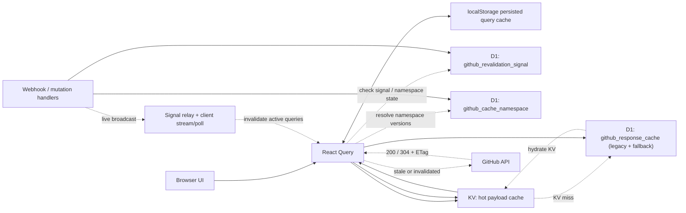
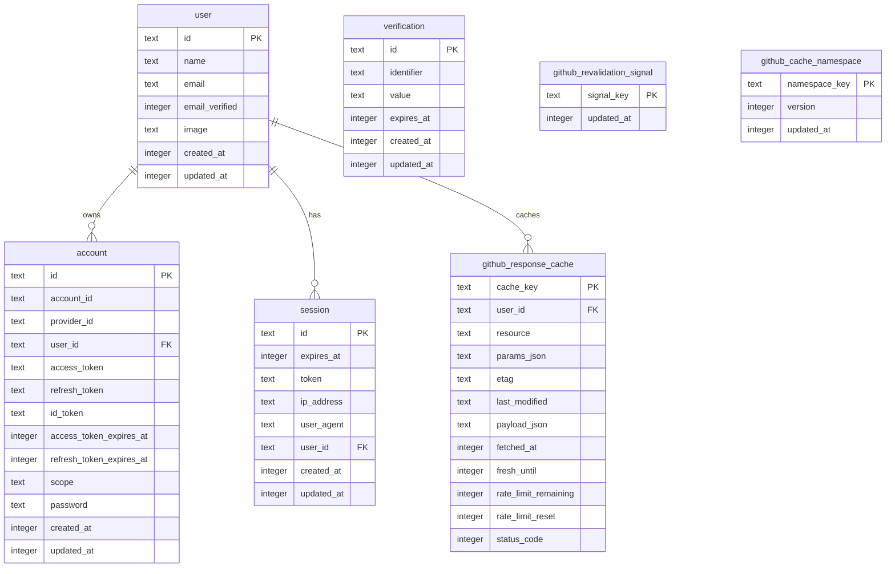

# DiffKit Caching Research

This note summarizes how the local DiffKit app implements GitHub caching, based on:

- `/Users/ray/dev/atlas/temp/diffkit/docs/github-cache-architecture.md`
- `/Users/ray/dev/atlas/temp/diffkit/apps/dashboard/src/lib/github-cache.ts`
- `/Users/ray/dev/atlas/temp/diffkit/apps/dashboard/src/lib/github-cache-policy.ts`
- `/Users/ray/dev/atlas/temp/diffkit/apps/dashboard/src/lib/query-client.tsx`
- `/Users/ray/dev/atlas/temp/diffkit/apps/dashboard/src/lib/github-revalidation.ts`
- `/Users/ray/dev/atlas/temp/diffkit/apps/dashboard/src/lib/github.server.ts`
- `/Users/ray/dev/atlas/temp/diffkit/apps/dashboard/src/lib/github-request-policy.ts`
- `/Users/ray/dev/atlas/temp/diffkit/apps/dashboard/src/lib/use-github-signal-stream.ts`
- `/Users/ray/dev/atlas/temp/diffkit/apps/dashboard/src/routes/api/webhooks/github.ts`
- `/Users/ray/dev/atlas/temp/diffkit/apps/dashboard/src/db/schema.ts`
- `/Users/ray/dev/atlas/temp/diffkit/apps/dashboard/wrangler.jsonc.example`
- related tests under `/Users/ray/dev/atlas/temp/diffkit/apps/dashboard/src/lib/*.test.ts`

## TL;DR

DiffKit uses a layered cache:

1. Browser cache via React Query.
2. Browser persistence via `localStorage`.
3. Durable invalidation state in Cloudflare D1.
4. Hot payload storage in Cloudflare KV.
5. Separate in-memory + KV caching for GitHub App installation tokens.

The most important architectural choice is this:

Browser state is fast, but D1 is the source of truth for invalidation.

That gives DiffKit fast tab switches and reloads without trusting the browser to decide staleness. GitHub webhooks and mutations write durable signal rows into D1, and split-cache reads incorporate namespace versions from D1 when building their KV keys.

## Architecture Diagram

What this shows:

- React Query is the fast browser cache.
- `localStorage` persists selected query state across reloads.
- D1 owns durable invalidation metadata.
- KV stores hot payloads for split-cache resources.
- legacy D1 response cache remains as fallback and hydration source.
- GitHub is only hit when cache is missing, stale, or invalidated.
- webhooks and mutations update D1 invalidation state and can also trigger live client refresh.

## Database Diagram

This is the actual SQLite shape from `apps/dashboard/drizzle`.

Notable points:

- `github_response_cache` is the only cache table tied directly to `user`
- `github_revalidation_signal` and `github_cache_namespace` are global cache-control tables
- KV payload cache and installation token cache are not shown here because they live outside SQLite

## Main Layers

### 1. Browser cache

The frontend uses TanStack Query as the first cache layer.

Key details:

- Query stale/gc windows are centralized in `github-cache-policy.ts`.
- Example policy values:
  - viewer: 30 min stale, 24 h gc
  - repo lists: 10 min stale, 12 h gc
  - "my pulls/issues/reviews": 30 s stale, 15 min gc
  - detail pages: 30 s stale, 10 min gc
  - activity: 20 s stale, 10 min gc
  - status: 15 s stale, 5 min gc

The browser cache is also persisted to `localStorage` in `query-client.tsx`.

Important behavior:

- Storage key: `diffkit:github-query-cache:v1`
- Persisted payload max age: 24 hours
- Only successful `github` queries with data are persisted
- Queries opt into persistence via query `meta`
- Two persistence modes exist:
  - `persist: true` for general reusable queries
  - `persist: "tab"` for tab-scoped detail queries
- On startup, the cache is rehydrated, then null-data queries are pruned
- Closed-tab queries are pruned so local storage does not keep growing
- Writes are debounced by 250 ms and flushed on `beforeunload`

This is not IndexedDB. DiffKit currently uses `localStorage` for persisted browser cache.

### 2. Durable control plane in D1

DiffKit keeps authoritative cache state in D1, not KV and not the browser.

Schema in `db/schema.ts`:

- `github_response_cache`
- `github_revalidation_signal`
- `github_cache_namespace`

What each table does:

- `github_response_cache`
  - legacy durable response cache
  - still written even when split KV cache is enabled
  - also acts as hydration fallback when KV misses
- `github_revalidation_signal`
  - one row per signal key
  - stores latest `updatedAt`
  - durable invalidation watermark
- `github_cache_namespace`
  - one row per namespace key
  - stores monotonically increasing namespace version
  - used to rotate KV keys without deleting old KV entries

This is the core design pattern worth copying: invalidation metadata is durable and tiny, while full payloads live in the cheaper/faster cache layer.

### 3. KV payload cache

Split-cache resources use Cloudflare KV (`GITHUB_CACHE_KV`) for the hot payload path.

KV entries store the same envelope shape as the legacy D1 cache:

- `payloadJson`
- `etag`
- `lastModified`
- `fetchedAt`
- `freshUntil`
- `rateLimitRemaining`
- `rateLimitReset`
- `statusCode`

Defaults:

- payload TTL: 7 days

The code always mirrors writes to legacy D1 plus KV. That means DiffKit has not fully cut over to KV-only payload storage yet.

## Cache Keys And Invalidation Keys

DiffKit explicitly separates:

- cache keys: identify one user + one resource + one param set
- namespace keys / signal keys: identify invalidation groups

Legacy cache key format:

- `userId::resource::stableSerializedParams`

Split KV key format:

- `gh:{userId}:{resource}:{paramsHash}:v{namespaceVersionHash}`

How KV keys are built:

1. Params are normalized into stable JSON.
2. Params JSON is hashed.
3. Namespace keys are resolved from D1 into versions.
4. The namespace/version list is stable-serialized and hashed.
5. The final KV key includes both hashes.

Result:

- one resource/param combination still has a stable identity
- but namespace bumps automatically move future reads to a new KV key
- old KV objects can just expire naturally instead of being deleted eagerly

This avoids delete storms and avoids relying on immediate KV consistency.

## Read Flow

The central read path is `getOrRevalidateGitHubResource()` in `github-cache.ts`.

The flow is:

1. Normalize params into stable JSON.
2. Build the legacy cache key.
3. If split mode is enabled, load namespace versions from D1.
4. Build the KV storage key from user/resource/params/namespace versions.
5. Read KV first.
6. If KV misses, read legacy D1.
7. If a cached entry is still fresh and there is no newer signal timestamp, return it.
8. If stale, call GitHub with conditional headers (`etag` / `last-modified`) when available.
9. If GitHub returns `304`, refresh metadata and freshness without replacing payload JSON.
10. If GitHub returns `200`, write the new envelope to D1 and KV.
11. If KV missed but D1 had a fresh entry, DiffKit hydrates KV from D1.

There is also request-scoped in-flight deduplication:

- a per-request `Map` avoids duplicate refreshes for the same cache key inside one request
- this is not cross-request or cross-worker dedupe

## Invalidation Model

DiffKit uses durable revalidation signals rather than trusting frontend timers.

Signal keys are generated in `github-revalidation.ts`. Examples:

- `pulls.mine`
- `issues.mine`
- `pull:{owner}/{repo}#{number}`
- `issue:{owner}/{repo}#{number}`
- `repoMeta:{owner}/{repo}`
- `repoCode:{owner}/{repo}`
- `repoLabels:{owner}/{repo}`
- `repoCollaborators:{owner}/{repo}`
- `orgTeams:{org}`
- `workflowRun:{owner}/{repo}#{id}`
- `workflowJob:{owner}/{repo}#{id}`
- `installationAccess`

Webhook flow:

1. GitHub webhook arrives at `/api/webhooks/github`.
2. Payload is mapped to signal keys.
3. `markGitHubRevalidationSignals()` upserts `github_revalidation_signal`.
4. The same call bumps namespace versions in `github_cache_namespace`.
5. Future reads compute new KV keys and skip old payloads automatically.

Mutation flow:

- server-side GitHub mutations also call the same signal-marking path
- same durable invalidation model applies

This means offline users still observe the newer state later, because the invalidation signal is durable in D1.

## Live Client Refresh

The architecture doc is partly outdated here.

The doc says the browser does not push realtime updates and mostly relies on later reads. Current code now has a live signal transport:

- `SignalRelay` Durable Object stores WebSocket subscriptions
- `/api/ws/signals` upgrades authenticated clients to WebSocket
- webhook handler broadcasts changed signal keys through the relay
- `use-github-signal-stream.ts` subscribes clients to relevant keys
- there is also a 90-second poll fallback to recover missed signals

Client invalidation behavior:

- only queries already in cache and not currently fetching are invalidated
- invalidation targets are specific query keys, not broad sweeps
- "My Pulls" and "My Issues" are force-merged into subscriptions so those views stay aligned everywhere

This is materially stronger than the doc's earlier "one-shot signal check" model.

## Rate-Limit Strategy

DiffKit handles GitHub rate limits in the cache layer first.

Adaptive freshness rules in `github-cache.ts`:

- if remaining quota <= 100, freshness is extended to at least 2 minutes
- if remaining quota <= 25, freshness is extended to at least 5 minutes or until just after reset

If GitHub returns rate-limit style errors (`403`/`429` with relevant headers):

- DiffKit serves stale cached payloads instead of failing
- `freshUntil` is extended using `retry-after`, `x-ratelimit-reset`, or a 60 s fallback
- status code is persisted for observability

There is also a separate stale-on-forbidden fallback:

- if GitHub returns access/forbidden style errors such as app authorization restrictions
- DiffKit serves stale cached data for 30 seconds

This is a deliberate UX choice: keep the app usable first, even under quota pressure or transient access issues.

## Request Budgeting And Timeouts

DiffKit also protects itself from slow GitHub operations.

Observed code behavior:

- request timeout signal defaults to 12 seconds in `github-request-policy.ts`
- `github.functions.ts` wraps some composed GitHub operations in explicit time-budget helpers
- recent timeout events are tracked as a global signal

This matters because DiffKit does several composed reads and aggregate search flows. Their design tries to return partial cached results instead of hanging on one slow GitHub path.

## Installation Token Caching

GitHub App installation tokens are cached separately from response payloads.

Implementation in `github.server.ts`:

- in-memory cache keyed by `installationId`
- in-flight dedupe map keyed by `installationId`
- KV-backed cache using the same `GITHUB_CACHE_KV` namespace
- cached token reused until 5 minutes before `expiresAt`
- KV TTL is set to token expiry minus that 5-minute refresh buffer

Invalidation:

- `installation`
- `installation_repositories`
- `github_app_authorization`

When those webhook events arrive:

- in-memory token is dropped
- in-flight entry is dropped
- KV token entry is deleted best-effort
- next read remints a token

This is a strong design because it avoids wasting installation token mints while still respecting permission changes quickly.

## What Is Actually On The Split Cache Path

The architecture doc's list is directionally correct, but current code shows broader coverage.

Verified split-cache resources include:

- viewer
- repo lists
- installation access checks
- my pulls / my issues aggregates
- pull detail, page data, comments, commits, status, files pages, file summaries, review comments
- issue detail, page data, comments
- repo collaborators, labels, discussions, branches, contributors
- repo overview
- repo tree and file content
- repo commit-related views:
  - `repos.commit`
  - `repo.fileLastCommit.v1`
  - `repo.refHeadCommit.v1`
  - `repo.treeEntryCommits.v1`
- repo participation stats
- reviewer bots
- org teams

The repo/code explorer path is especially notable: DiffKit applies the same signal-keyed cache model to code browsing, not just issues and PRs.

## Browser Persistence Policy

DiffKit is selective about what it persists in the browser.

Persisted globally:

- viewer
- repo lists
- top-level list queries
- some profile/repo metadata queries

Persisted only while corresponding tabs still exist:

- pull detail/page/comments/status/files
- issue detail/page/comments
- repo detail-style tab content

That keeps reloads fast without turning local storage into an unbounded dump of every GitHub response.

## Design Strengths

The strongest parts of the DiffKit approach are:

- Durable invalidation in D1 instead of browser-led staleness decisions
- Namespace-versioned KV keys instead of synchronous delete-based invalidation
- Conditional revalidation with `ETag` / `Last-Modified`
- Graceful stale serving under rate limits
- Token caching treated as a first-class cache problem
- Browser persistence scoped by UX value, not "persist everything"
- Live signal-driven invalidation layered on top of normal query caching

## Design Tradeoffs / Limits

Observed limits:

- Payloads are still mirrored to D1, so write amplification is not fully eliminated
- In-flight dedupe is request-scoped, not global
- Installation token dedupe is isolate-scoped before KV kicks in
- KV is still not the invalidation authority
- Browser persistence uses `localStorage`, so scale is lower than IndexedDB-backed persistence
- Some architecture docs have drifted behind the implementation

## Doc vs Code Drift

The local note `docs/github-cache-architecture.md` is useful, but it no longer fully matches current code.

Notable differences:

1. Realtime client behavior
   - Doc: no realtime push, mostly later reads / one-shot checks
   - Code: WebSocket signal relay plus 90-second polling fallback

2. Octokit retry/throttle behavior
   - Doc: says Octokit retry and throttling plugins are enabled with retry rules
   - Code: current `Octokit` instances are created with `retry: { enabled: false }` and `throttle: { enabled: false }`
   - Current code uses request timeouts and rate-limit logging instead

3. Signal refresh hook naming / model
   - Doc references `use-github-signal-refresh.ts`
   - Current implementation uses `use-github-signal-stream.ts`

So the note is still valuable for the core design, but it should not be treated as perfectly current.

## Practical Takeaways For Atlas

If Atlas wants to copy the DiffKit model, the highest-value pieces are:

- Keep invalidation state in SQLite/D1-like durable metadata tables
- Use a split design where payloads can live in a faster cache, but invalidation stays durable
- Version namespaces instead of deleting cache entries aggressively
- Persist only UX-critical browser queries
- Build stale-if-rate-limited behavior into the cache layer
- Cache GitHub App installation tokens explicitly
- Use fine-grained signal keys for webhook-driven invalidation

If Atlas does not need Cloudflare-specific infrastructure, the DiffKit design can still translate cleanly:

- D1 -> local SQLite
- KV -> local SQLite blob table, LMDB, or file-backed object cache
- Durable Object signal relay -> app-local event bus or websocket bridge

The key insight is not the vendor choice. The key insight is:

Use durable invalidation metadata plus cheap payload storage, and let server-observed GitHub events decide freshness.
