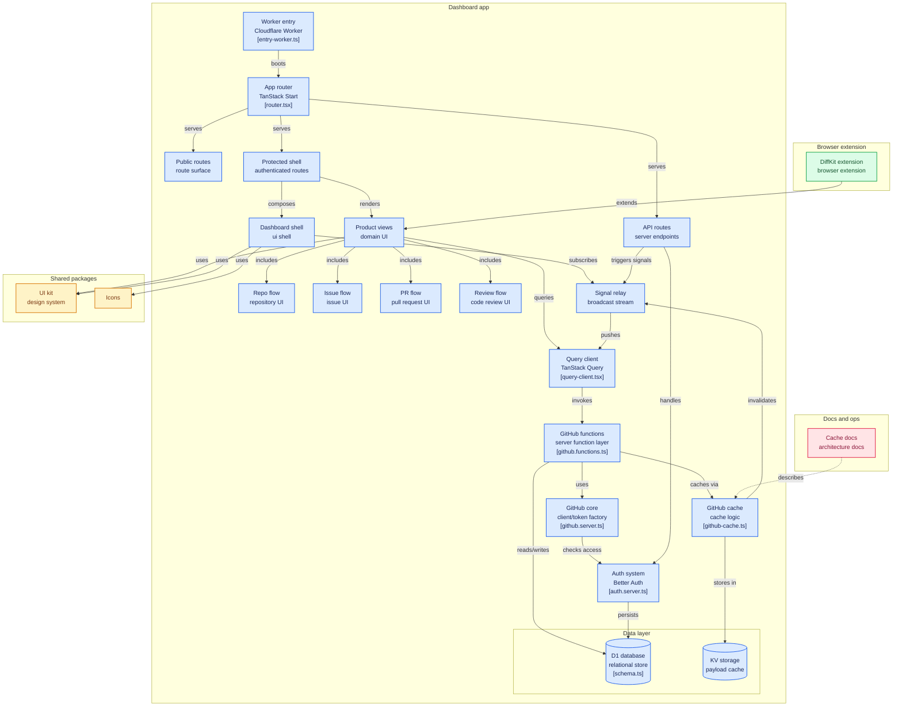

```mermaid
flowchart TD

subgraph group_group_app["Dashboard app"]
  node_node_worker["Worker entry<br/>Cloudflare Worker<br/>[entry-worker.ts]"]
  node_node_router["App router<br/>TanStack Start<br/>[router.tsx]"]
  node_node_public_routes["Public routes<br/>route surface"]
  node_node_protected_routes["Protected shell<br/>authenticated routes"]
  node_node_api_routes["API routes<br/>server endpoints"]
  node_node_layout_shell["Dashboard shell<br/>ui shell"]
  node_node_product_views["Product views<br/>domain UI"]
  node_node_repo_views["Repo flow<br/>repository UI"]
  node_node_issue_views["Issue flow<br/>issue UI"]
  node_node_pull_views["PR flow<br/>pull request UI"]
  node_node_review_views["Review flow<br/>code review UI"]
  node_node_data_client["Query client<br/>TanStack Query<br/>[query-client.tsx]"]
  node_node_github_functions["GitHub functions<br/>server function layer<br/>[github.functions.ts]"]
  node_node_github_core["GitHub core<br/>client/token factory<br/>[github.server.ts]"]
  node_node_github_cache["GitHub cache<br/>cache logic<br/>[github-cache.ts]"]
  node_node_signal_relay["Signal relay<br/>broadcast stream"]
  node_node_auth["Auth system<br/>Better Auth<br/>[auth.server.ts]"]
  
  subgraph group_data_layer["Data layer"]
    node_node_db[("D1 database<br/>relational store<br/>[schema.ts]")]
    node_node_kv[("KV storage<br/>payload cache")]
  end
end

subgraph group_group_packages["Shared packages"]
  node_node_ui_kit["UI kit<br/>design system"]
  node_node_icons["Icons"]
end

subgraph group_group_extension["Browser extension"]
  node_node_extension["DiffKit extension<br/>browser extension"]
end

subgraph group_group_docs_ops["Docs and ops"]
  node_node_cache_docs["Cache docs<br/>architecture docs"]
end

node_node_worker -->|"boots"| node_node_router
node_node_router -->|"serves"| node_node_public_routes
node_node_router -->|"serves"| node_node_protected_routes
node_node_router -->|"serves"| node_node_api_routes
node_node_protected_routes -->|"composes"| node_node_layout_shell
node_node_protected_routes -->|"renders"| node_node_product_views
node_node_product_views -->|"includes"| node_node_repo_views
node_node_product_views -->|"includes"| node_node_issue_views
node_node_product_views -->|"includes"| node_node_pull_views
node_node_product_views -->|"includes"| node_node_review_views
node_node_product_views -->|"uses"| node_node_ui_kit
node_node_layout_shell -->|"uses"| node_node_ui_kit
node_node_layout_shell -->|"uses"| node_node_icons
node_node_layout_shell -->|"subscribes"| node_node_signal_relay
node_node_product_views -->|"queries"| node_node_data_client
node_node_data_client -->|"invokes"| node_node_github_functions
node_node_github_functions -->|"uses"| node_node_github_core
node_node_github_core -->|"checks access"| node_node_auth
node_node_github_functions -->|"reads/writes"| node_node_db
node_node_github_functions -->|"caches via"| node_node_github_cache
node_node_github_cache -->|"stores in"| node_node_kv
node_node_github_cache -->|"invalidates"| node_node_signal_relay
node_node_api_routes -->|"handles"| node_node_auth
node_node_api_routes -->|"triggers signals"| node_node_signal_relay
node_node_auth -->|"persists"| node_node_db
node_node_signal_relay -->|"pushes"| node_node_data_client
node_node_extension -->|"extends"| node_node_product_views
node_node_cache_docs -.->|"describes"| node_node_github_cache

click node_node_worker "https://github.com/stylessh/diffkit/blob/main/apps/dashboard/src/entry-worker.ts"
click node_node_router "https://github.com/stylessh/diffkit/blob/main/apps/dashboard/src/router.tsx"
click node_node_public_routes "https://github.com/stylessh/diffkit/tree/main/apps/dashboard/src/routes"
click node_node_protected_routes "https://github.com/stylessh/diffkit/tree/main/apps/dashboard/src/routes/_protected"
click node_node_api_routes "https://github.com/stylessh/diffkit/tree/main/apps/dashboard/src/routes/api"
click node_node_layout_shell "https://github.com/stylessh/diffkit/tree/main/apps/dashboard/src/components/layouts"
click node_node_product_views "https://github.com/stylessh/diffkit/tree/main/apps/dashboard/src/components"
click node_node_repo_views "https://github.com/stylessh/diffkit/tree/main/apps/dashboard/src/components/repo"
click node_node_issue_views "https://github.com/stylessh/diffkit/tree/main/apps/dashboard/src/components/issues"
click node_node_pull_views "https://github.com/stylessh/diffkit/tree/main/apps/dashboard/src/components/pulls"
click node_node_review_views "https://github.com/stylessh/diffkit/tree/main/apps/dashboard/src/components/pulls/review"
click node_node_data_client "https://github.com/stylessh/diffkit/blob/main/apps/dashboard/src/lib/query-client.tsx"
click node_node_github_functions "https://github.com/stylessh/diffkit/blob/main/apps/dashboard/src/lib/github.functions.ts"
click node_node_github_core "https://github.com/stylessh/diffkit/blob/main/apps/dashboard/src/lib/github.server.ts"
click node_node_github_cache "https://github.com/stylessh/diffkit/blob/main/apps/dashboard/src/lib/github-cache.ts"
click node_node_signal_relay "https://github.com/stylessh/diffkit/blob/main/apps/dashboard/src/lib/signal-relay.server.ts"
click node_node_auth "https://github.com/stylessh/diffkit/blob/main/apps/dashboard/src/lib/auth.server.ts"
click node_node_db "https://github.com/stylessh/diffkit/blob/main/apps/dashboard/src/db/schema.ts"
click node_node_ui_kit "https://github.com/stylessh/diffkit/tree/main/packages/ui/src/components"
click node_node_icons "https://github.com/stylessh/diffkit/tree/main/packages/icons/src"
click node_node_extension "https://github.com/stylessh/diffkit/tree/main/extensions/diffkit-redirect"
click node_node_cache_docs "https://github.com/stylessh/diffkit/blob/main/docs/github-cache-architecture.md"

classDef toneNeutral fill:#f8fafc,stroke:#334155,stroke-width:1.5px,color:#0f172a
classDef toneBlue fill:#dbeafe,stroke:#2563eb,stroke-width:1.5px,color:#172554
classDef toneAmber fill:#fef3c7,stroke:#d97706,stroke-width:1.5px,color:#78350f
classDef toneMint fill:#dcfce7,stroke:#16a34a,stroke-width:1.5px,color:#14532d
classDef toneRose fill:#ffe4e6,stroke:#e11d48,stroke-width:1.5px,color:#881337
classDef toneIndigo fill:#e0e7ff,stroke:#4f46e5,stroke-width:1.5px,color:#312e81
classDef toneTeal fill:#ccfbf1,stroke:#0f766e,stroke-width:1.5px,color:#134e4a
class node_node_worker,node_node_router,node_node_public_routes,node_node_protected_routes,node_node_api_routes,node_node_layout_shell,node_node_product_views,node_node_repo_views,node_node_issue_views,node_node_pull_views,node_node_review_views,node_node_data_client,node_node_github_functions,node_node_github_core,node_node_github_cache,node_node_signal_relay,node_node_auth,node_node_db,node_node_kv toneBlue
class node_node_ui_kit,node_node_icons toneAmber
class node_node_extension toneMint
class node_node_cache_docs toneRose
```
